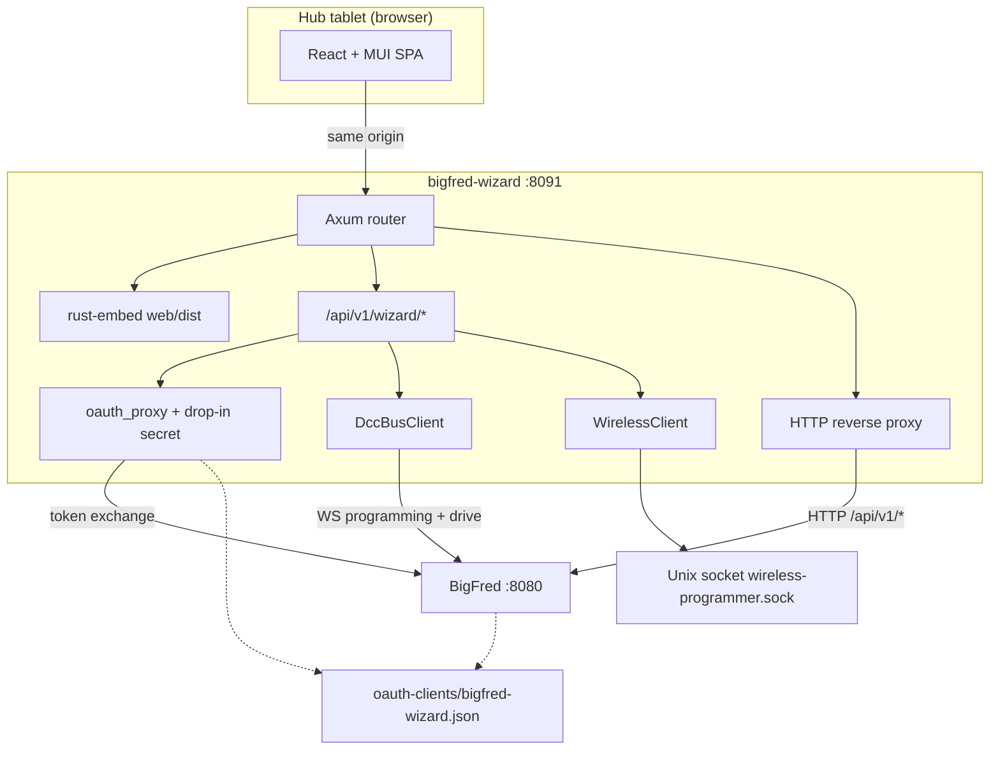
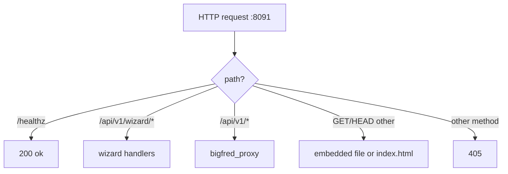
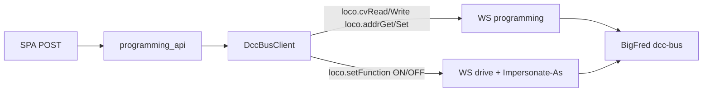

# BigFred Wizard — Architecture

bigfred-wizard is the party/event kiosk that sits in front of
[BigFred](https://github.com/dcc-bigfred/bigfred) on the hub tablet
(`:8091`). One process serves three things:

- the embedded React SPA (`web/dist`, via `rust-embed`),
- `/api/v1/wizard/*` — public config, the confidential OAuth token
  exchange, decoder programming, and wireless-programmer HTTP/SSE,
- everything else under `/api/v1/*` — reverse-proxied to BigFred so the
  SPA stays same-origin.

Hub OS pulls the static **linux/arm64** binary from this repo’s CI
artifacts (same pattern as [micronet](https://github.com/dcc-bigfred/micronet)).
Overlays (init.d, microinit, microdns) live in
[bigfred-os](https://github.com/dcc-bigfred/bigfred-os).

This document is the canonical architecture reference. The
[README](README.md) is the end-user description; coding standards live in
[CODING-GUIDELINES.md](CODING-GUIDELINES.md).

---

## 1. Assumptions

1. **Kiosk, not a command station.** The wizard never talks to the rails
   itself. BigFred owns layouts, roster, SSO, remotes, and the dcc-bus
   daemon. wireless-programmer owns Soft-AP / Z21-dispatch programming of
   physical handsets.
2. **Loopback HTTP only.** `bigfredUrl` must be loopback `http://`. This
   binary has **no TLS** (`reqwest` without rustls/native-tls): the
   tablet and BigFred share the hub, and linking OpenSSL into a static
   musl build is a needless liability.
3. **Same-origin SPA.** The browser never opens a second origin, CORS, or
   a WebSocket. dcc-bus sockets and the wireless-programmer Unix socket
   stay inside the daemon.
4. **Organizer session, participant work.** The tablet signs in once via
   BigFred OAuth2 (confidential client). Flows act as a chosen
   participant through `X-BigFred-Impersonate-As`. The kiosk must not
   keep a driver JWT (PIN verify drops the minted session).
5. **Offline bundle.** The hub tablet may have no Internet. Vite targets
   `chrome87`; `web/scripts/check-offline-bundle.mjs` fails the build if
   `dist/` would fetch fonts/scripts from a CDN.
6. **Hot-reload config, cold-bind HTTP.** `bigfred-wizard.json` is
   watched with inotify. Invalid JSON keeps the previous config. Changes
   to `http` / CORS require a process restart (the listener and
   `CorsLayer` are bound at start).
7. **Sibling `wp-proto`.** Wire types for the wireless-programmer Unix
   socket come from `../wireless-programmer/crates/wp-proto` (cloned in
   CI). The SPA never opens that socket.
8. **Foreground tokio daemon.** Unlike microwaf / wireless-programmer
   (`std::thread`), the wizard is an Axum/tokio process: HTTP, two
   dcc-bus WebSockets, and Unix-socket round-trips share the runtime.
   The config watcher is the one extra `std::thread` (notify + debounce).
9. **arm64 + amd64 musl.** CI produces static binaries; the Pi/hub runs
   the `arm64` build. `enabled: false` by default so a fresh image does
   not expose the kiosk until an operator turns it on.

---

## 2. High-level architecture



Boot in `src/main.rs`: load/seed config, ensure the OAuth drop-in,
spawn the inotify reloader, bind `:8091`, serve until SIGINT/SIGTERM.

---

## 3. Workspace layout

```
bigfred-wizard/
├── Cargo.toml                 # single binary crate
├── Makefile                   # web-build, host, musl, test, dev-*
├── README.md                  # end-user description
├── ARCHITECTURE.md            # this file
├── CODING-GUIDELINES.md       # Rust / TypeScript engineering rules
├── LICENSE                    # MIT
├── dev-config.json.example
├── docs/screenshot-main.png
├── .github/workflows/{ci,release}.yml
├── src/                       # Axum daemon
│   ├── main.rs                # listen, router, SPA fallback
│   ├── config.rs / config_watch.rs
│   ├── ensure_client.rs       # OAuth drop-in
│   ├── oauth_proxy.rs
│   ├── bigfred_proxy.rs
│   ├── dccbus_client.rs
│   ├── programming_api.rs
│   ├── wireless_api.rs
│   ├── handset_api.rs / pin_api.rs / qr.rs
│   └── error.rs
└── web/                       # Vite + React SPA
    ├── src/pages/             # Home, account, drive, loco, login
    ├── src/api/               # same-origin fetch + wireless SSE
    ├── src/auth/              # SSO + idle logout
    ├── src/drive/devices.ts   # device catalogue
    └── scripts/check-offline-bundle.mjs
```

Not a Cargo workspace of many crates: one binary plus an npm frontend
that is compiled into that binary.

---

## 4. Module responsibilities

| Module | Role | I/O? |
|---|---|---|
| **config** | `bigfred-wizard.json` + `.example` seed, `PublicConfig` (no PSK / no OAuth secret), builtin redirect URIs | filesystem |
| **config_watch** | inotify on the config directory, 300 ms debounce, ignore `.example` / editor junk | inotify thread |
| **ensure_client** | Seeds `$DATA_DIR/etc/bigfred/oauth-clients/<clientId>.json` (0640, group `bigfred`), merges builtin redirect URIs, never overwrites an existing secret | filesystem |
| **oauth_proxy** | `POST /api/v1/wizard/oauth/token` — SPA sends the auth code; daemon adds `clientSecret` and exchanges with BigFred | HTTP to BigFred |
| **bigfred_proxy** | Same-origin reverse proxy for `/api/v1/*` except `/wizard/*`. Forwards `authorization`, `content-type`, `accept`, `X-BigFred-Impersonate-As`. Rejects WebSocket upgrades. Body cap 2 MiB | HTTP to BigFred |
| **dccbus_client** | Two long-lived WS sockets to BigFred dcc-bus (programming + impersonated drive), keepalive 2 s, exponential reconnect | WebSocket |
| **programming_api** | HTTP face of CV/address/F2 pulse; SPA never speaks WS | via dccbus_client |
| **wireless_api** | REST/SSE face of wireless-programmer (`wp-proto` length-prefixed JSON) | Unix socket |
| **handset_api** | Authenticated Wi‑Fi SSID/PSK + Z21 IPv4 for on-screen WlanMaus steps | DNS lookup |
| **pin_api** | Verify participant PIN against BigFred; drop the minted JWT | HTTP to BigFred |
| **qr** | SVG QR for `android` / `bigfred` / `railbox` store or public URLs | none |
| **web SPA** | Fullscreen tiles, i18n (pl/en/de), device-specific steppers | fetch / EventSource |

**Dependency direction:** `config` ← every module. `programming_api` and
`pin_api` share bearer extraction. `wireless_api` depends on `wp-proto`
only. The SPA depends on the daemon’s HTTP surface, not on Rust types
(hand-written TypeScript DTOs in `web/src/api/types.ts`).

---

## 5. Request dispatch



SPA routing is client-side (`react-router-dom`). Unknown paths fall
back to `index.html`. Hashed assets get `Cache-Control: immutable`;
`index.html` is `no-cache`.

Protected UI routes (`/`, `/flow/*`) require an organizer Bearer token
in `sessionStorage`. `/login` and `/auth/callback` are public. `/about`
is the diagnostic page (versions, dcc-bus, wireless-programmer hello).

---

## 6. Authentication

### Organizer SSO

1. SPA loads `GET /api/v1/wizard/config` (public; polled every 15 s so
   `enabled` flips without a reload).
2. Organizer picks a layout, SPA redirects the browser to BigFred’s
   authorize URL with `client_id=bigfred-wizard`, a random `state`, and
   a redirect URI from the allowlist that matches `window.location.origin`.
3. BigFred redirects to `/auth/callback?code&state`.
4. SPA posts `{ code, redirectUri, state }` to
   `POST /api/v1/wizard/oauth/token`. CSRF `state` is checked in the
   browser (which minted it). The daemon injects `clientSecret` from the
   drop-in and exchanges the code with BigFred.
5. Access token lives in `sessionStorage` only. Idle timeout
   (`idleTimeoutSecs`, default 86400) logs the kiosk out.

The wizard OAuth drop-in is seeded with `shareSession: false`. Logging in
through wizard SSO therefore does **not** leave a BigFred web session cookie.
An existing `bigfred_session` (operator already signed in to BigFred) is still
reused silently. Set `"shareSession": true` in the drop-in to restore the old
shared-session behaviour.

Builtin redirect URIs always include `:8091` (production) and
`bigfred.local:5175` (Vite). A port drift here silently breaks tablet
SSO.

### Impersonation

BigFred’s `MaybeImpersonate` accepts `X-BigFred-Impersonate-As: <login>`
on the organizer token. The SPA sends it on roster/user writes and on
F2 pulses so `CanDrive` sees the vehicle owner, not the organizer.

`POST /api/v1/wizard/verify-pin` checks `{ login, pin, layoutId }`
against BigFred login and **discards** the resulting session. WiFred /
LongFred commissioning needs the PIN on the handset, not a second
browser login.

---

## 7. SPA flows

| Route | Page | What it does |
|---|---|---|
| `/` | `HomePage` | Five tiles: getting-started help, account, drive, loco, wired FRED |
| `/flow/account` | `CreateAccountPage` | Login (letters a–z), 4–6 digit PIN, optional club; `autoAllocateDccCount` from config |
| `/flow/drive` | `DriveFlowPage` | Device catalogue → per-device stepper |
| `/flow/loco` | `ConfigureLocoPage` | Pick participant → roster entry → programming-track address |
| `/login` | `LoginPage` | Organizer SSO + layout picker |
| `/about` | `AboutPage` | Diagnostics (gear icon) |

Drive devices (`web/src/drive/devices.ts`):

| Device | Protocol | How it is set up |
|---|---|---|
| Android / other phone | BigFred app or web | QR (`/api/v1/wizard/qr.svg`) |
| Roco WlanMaus | Z21 | On-screen Wi‑Fi + pairing locomotive + function-key digits |
| RailBOX | Z21 | Play Store QR + IP + pairing loco |
| LongFred / WiFred | WiThrottle + BigFred pairing | wireless-programmer Soft-AP job (SSE progress) |
| Digitrax FRED | Z21 LAN `DISPATCH` | wireless-programmer `fred` driver; optional guest DCC-only path |
| Other WiThrottle | WiThrottle | Advanced pairing instructions |

Legacy `/flow/phone`, `/flow/wlanmaus`, `/flow/longfred` redirect to
`/flow/drive`. Wired FRED is `/flow/drive?device=fred`.

i18n: `pl` / `en` / `de`, fallback `pl`, flag switcher in `AppShell`.
Help overlays (`HelpContext`) explain “why an account” and “what should
I choose?” without leaving the flow.

---

## 8. Decoder programming (dcc-bus)

The SPA never opens a WebSocket. It POSTs to
`/api/v1/wizard/programming/*`; the daemon translates to dcc-bus frames
and waits for the ack (30 s).



Two sockets, each with 2 s pings (must stay below the dcc-bus deadman):

- **programming** — organizer JWT; CV / address on the programming track
  (`mode: prog`) or POM (`mode: pom`).
- **drive** — organizer JWT + impersonation for the selected
  participant; F2 (and similar) pulses on the ops track. Replaced when
  the wizard picks a different user.

Both are warmed eagerly (`ensure_connected` after login, `ensure_drive`
when a participant is selected) and re-dialled with exponential backoff.
If no layout session has started the station, BigFred’s proxy answers
`503` → `dcc_bus_unavailable`.

`function_pulse` holds a per-`(address, function)` semaphore so a second
pulse cannot interleave ON/OFF and leave a function latched (`429
function_pulse_busy`). Registry cap 4096 keys.

CV range 1–1024; DCC address 1–10239; function 0–31; pulse 1–5000 ms
(default 1000).

---

## 9. Wireless programmer

`WirelessClient` dials
`$DATA_DIR/run/wireless-programmer/wireless-programmer.sock` (configurable),
writes `wp-proto` frames (4-byte LE length + JSON), and maps daemon
errors onto HTTP.

| HTTP | Socket |
|---|---|
| `GET /wizard/wireless/hello` | `Hello` |
| `GET /wizard/wireless/link-status` | `LinkStatus` |
| `GET /wizard/wireless/scan?mode=` | `Scan` (`ap` / `z21` / `lan` / `usb`) |
| `POST /wizard/wireless/probe` | `Probe` |
| `POST /wizard/wireless/program` | `Program` (daemon fills Wi‑Fi + throttle server from config; FRED skips Wi‑Fi) |
| `GET /wizard/wireless/jobs/:id/events` | `JobWatch` → SSE `frame` / `error` |
| `POST /wizard/wireless/jobs/:id/cancel` | `JobCancel` |

LongFred / WiFred: operator puts the handset in Soft-AP mode, wizard
scans `ap`, programs identity + roster + BigFred login/PIN. FRED: scan
`z21`, plug into a LocoNet jack, `DISPATCH` the DCC address. Config
`fredProgramming.z21` with **both** `address` non-empty **and** `port`
non-zero skips the station picker (do not rely on protocol default
21105 for skip).

---

## 10. Configuration

On the device: `/data/etc/bigfred/wizard/bigfred-wizard.json`
(`$BIGFRED_DATA_DIR` / `$DATA_DIR` / `/data`). At start the daemon
rewrites the sibling `.example` and, if the live file is missing, seeds
it from defaults (`enabled: false`).

```json
{
  "http": "0.0.0.0:8091",
  "enabled": true,
  "bigfredUrl": "http://127.0.0.1:8080",
  "bigfredPublicUrl": "http://bigfred.local:8080",
  "androidAppUrl": "https://play.google.com/store/apps/details?id=…",
  "ssoClientId": "bigfred-wizard",
  "dccPerUser": 25,
  "idleTimeoutSecs": 86400,
  "wifiSsid": "bigfred2",
  "wifiPsk": "",
  "throttleServerHost": "bigfred.local",
  "throttleServerPort": 12090,
  "throttleServerAutomatic": true,
  "wirelessProgrammerSocket": "/data/run/wireless-programmer/wireless-programmer.sock",
  "fredProgramming": { "z21": { "address": "", "port": 0 } }
}
```

`PublicConfig` exposes SSID and `wifiPskConfigured` (boolean), never the
PSK. Organizer-only `GET /api/v1/wizard/handset-setup` returns the PSK
for WlanMaus on-screen steps.

---

## 11. Build, CI, local development

```bash
make web-build          # npm ci && vite build → web/dist
make host               # native binary (runs web-build first)
make release-musl       # dist/bigfred-wizard-linux-arm64
make test
```

```bash
# Terminal 1 — backend (:8091)
make dev-backend

# Terminal 2 — Vite (:5175) proxies /api to the backend
make dev-web
```

On first start the daemon lazy-creates the OAuth drop-in. Point BigFred
at the **same** data dir so it picks up the file (hot-reload):

```bash
BIGFRED_DATA_DIR=$PWD/.dev-data bigfred …
```

CI (`.github/workflows/ci.yml`): rustfmt, clippy, `cargo test` +
`release-assertions`, clone `wireless-programmer` for `wp-proto`, then
musl builds for arm64 and amd64 with the SPA embedded. Tagged `v*`
builds feed hub OS.

---

## 12. Security model

- Confidential OAuth client: secret stays on disk (0640, group
  `bigfred`) and is used only by `oauth_proxy`. The browser sees the
  authorization code, never the secret.
- Redirect URIs are an exact-match allowlist plus builtins. Token
  exchange rejects anything else.
- Proxy is a denylist of hop-by-hop / cookie / host headers: only
  `authorization`, `content-type`, `accept`, and impersonation are
  forwarded. WebSockets are not proxied.
- Programming and handset-setup require `Authorization: Bearer`.
  `enabled: false` refuses wizard flows (`wizard_disabled`) and the SPA
  shows a disabled screen.
- Wi‑Fi PSK is not in `PublicConfig`. It is returned only to an
  authenticated organizer for on-screen copying onto a WlanMaus.
- No driver JWT is stored for PIN checks.

---

## 13. Limitations / future

- **One organizer kiosk.** There is no multi-tablet session lock; two
  tablets with the same organizer token can race on pairing and
  programming.
- **Programming station is BigFred’s.** The wizard picks a catalogue
  station with `programming: true`; it cannot start a layout session.
  The organizer must open the layout in BigFred once so dcc-bus is up.
- **No TLS, no clustering.** One process per hub; state is the live
  config plus two WebSockets.
- **TypeScript DTOs are hand-written** (no tygo). Keep them a thin
  slice of BigFred’s protocol.
- **LongFred variants** in the SPA are currently `markwtech` only;
  `devices.ts` is the extension point.
- **FRED guest path** (DCC address only, no account) does not create a
  roster entry unless the organizer continues into the loco flow.
