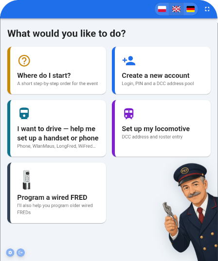

# BigFred Wizard

BigFred Wizard is the helper on the event tablet: it walks guests through everything they need to drive on the layout. An organizer signs in once; after that participants tap large tiles and follow on-screen steps — no technical knowledge required. The wizard speaks Polish, English and German and can run fullscreen like a kiosk.

## What you can do

- See a short “where do I start?” order for the event
- Create a participant account (login, PIN, and reserved locomotive addresses)
- Set up driving from a phone — BigFred app on Android, or the website on any phone
- Set up a Roco WlanMaus or the RailBOX app
- Program a LongFred or WiFred wireless handset
- Program an older wired Digitrax FRED
- Register a locomotive (DCC address and roster entry)

## Technical docs

[ARCHITECTURE.md](ARCHITECTURE.md). License: MIT.

## Project

This project is part of [BigFred](https://github.com/dcc-bigfred) ecosystem.
